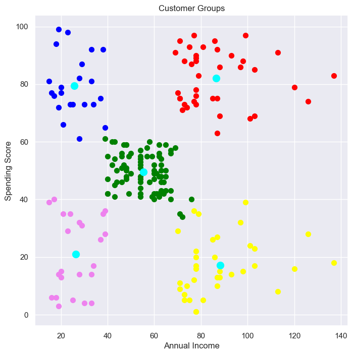
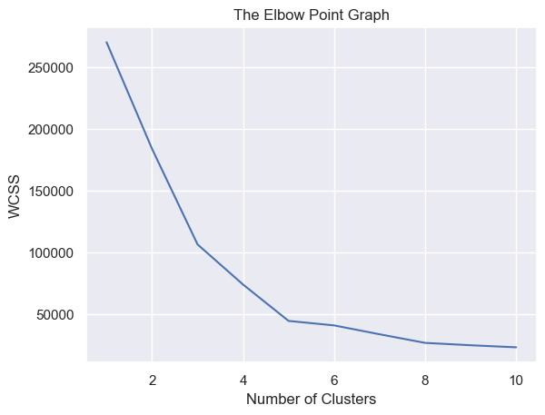

# 🛍️ Customer Segmentation using K-Means Clustering

Segmenting mall customers based on their **Annual Income** and **Spending Score** using the **K-Means** clustering algorithm.

---

## 📌 Project Objective

To perform unsupervised customer segmentation to help businesses understand different customer types and enable targeted marketing strategies.

---

## 📊 Dataset

- **Source**: [Mall_Customers.csv](https://www.kaggle.com/datasets/vjchoudhary7/customer-segmentation-tutorial-in-python)
- **Features**:
  - `CustomerID`
  - `Gender`
  - `Age`
  - `Annual Income (k$)`
  - `Spending Score (1-100)`

---

## ⚙️ Technologies & Tools Used

- Python 🐍
- Pandas
- NumPy
- Matplotlib
- Seaborn
- Scikit-learn (KMeans Clustering)

---

## 🚀 Workflow

1. **Data Loading and Cleaning**
   - Loaded dataset using `pandas`
   - Checked for missing values

2. **Feature Selection**
   - Used only `Annual Income` and `Spending Score` for clustering

3. **Elbow Method for Optimal Clusters**
   - Calculated WCSS for K=1 to 10
   - Plotted Elbow graph to find best K (optimal at K=5)

4. **K-Means Clustering**
   - Applied `KMeans(n_clusters=5)`
   - Clustered customers into 5 segments

5. **Visualization**
   - Plotted each cluster with distinct color
   - Marked centroids of clusters

---

## 📈 Visual Output

| Customer Clusters | Elbow Method |
|-------------------|--------------|
|  |  |

---

## 📌 Insights

- Cluster 1: High income, low spenders
- Cluster 2: Low income, high spenders
- Cluster 3: Average income, average spenders
- ...
- Business can use this for **targeted advertising**, **loyalty programs**, and **personalized offers**

---

## 📁 How to Run

```bash
git clone https://github.com/yourusername/customer-segmentation-kmeans.git
cd customer-segmentation-kmeans
pip install -r requirements.txt
jupyter notebook
